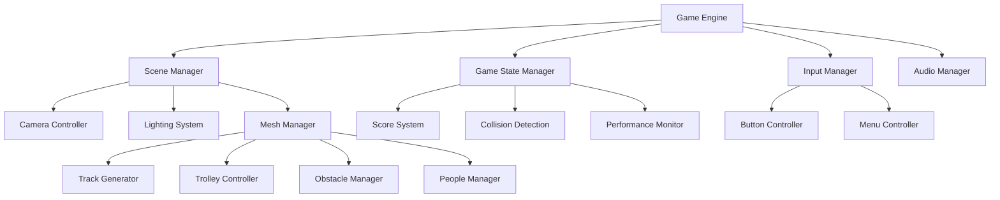

# Design Document

## Overview

The "Trolley Problem" game is a 3D browser-based game built with Three.js that combines moral decision-making with fast-paced arcade gameplay. The game uses an isometric camera perspective and features a trolley that continuously moves through procedurally generated track segments. Players must make split-second decisions to switch between 5 parallel tracks to avoid obstacles while minimizing casualties.

The architecture follows a modular design pattern with clear separation between game logic, rendering, input handling, and state management. The game uses object pooling and level-of-detail techniques to maintain smooth performance across different devices.

## Architecture

### High-Level Architecture



### Core Systems

1. **Game Engine**: Central coordinator that manages all subsystems and the main game loop
2. **Scene Manager**: Handles Three.js scene setup, camera, lighting, and rendering pipeline
3. **Input Manager**: Processes user input from track selection buttons and menu interactions
4. **Game State Manager**: Maintains game state, score, and progression logic
5. **Track Generator**: Procedurally generates track segments with obstacles and people
6. **Performance Manager**: Optimizes rendering by culling off-screen objects and managing LOD

## Components and Interfaces

### Core Game Components

#### GameEngine
```typescript
interface GameEngine {
  initialize(): void;
  start(): void;
  pause(): void;
  resume(): void;
  update(deltaTime: number): void;
  render(): void;
  destroy(): void;
}
```

#### SceneManager
```typescript
interface SceneManager {
  scene: THREE.Scene;
  camera: THREE.Camera;
  renderer: THREE.WebGLRenderer;
  
  setupScene(): void;
  setupCamera(): void;
  setupLighting(): void;
  addToScene(object: THREE.Object3D): void;
  removeFromScene(object: THREE.Object3D): void;
}
```

#### TrackGenerator
```typescript
interface TrackGenerator {
  generateSegment(segmentIndex: number): TrackSegment;
  cleanupOldSegments(): void;
  getVisibleSegments(): TrackSegment[];
}

interface TrackSegment {
  id: number;
  tracks: Track[];
  obstacles: Obstacle[];
  people: Person[];
  position: THREE.Vector3;
}
```

#### TrolleyController
```typescript
interface TrolleyController {
  position: THREE.Vector3;
  currentTrack: number;
  targetTrack: number;
  speed: number;
  baseSpeed: number;
  
  update(deltaTime: number): void;
  switchToTrack(trackNumber: number): void;
  increaseSpeed(): void;
  checkCollisions(): CollisionResult[];
}
```

#### GameState
```typescript
interface GameState {
  score: number;
  peopleHit: number;
  peopleAvoided: number;
  currentSegment: number;
  isGameOver: boolean;
  isPaused: boolean;
  selectedTrack: number;
  
  updateScore(peopleHit: number, peopleAvoided: number): void;
  incrementSegment(): void;
  endGame(): void;
}
```

### UI Components

#### MenuSystem
```typescript
interface MenuSystem {
  currentMenu: MenuType;
  
  showMainMenu(): void;
  showGameUI(): void;
  showPauseMenu(): void;
  showGameOverScreen(): void;
  handleMenuSelection(option: string): void;
}
```

#### TrackSelector
```typescript
interface TrackSelector {
  selectedTrack: number;
  buttons: TrackButton[];
  
  selectTrack(trackNumber: number): void;
  updateVisualFeedback(): void;
  showPathPreview(trackNumber: number): void;
}
```

## Data Models

### Game Objects

#### Track
```typescript
class Track {
  id: number;
  position: THREE.Vector3;
  geometry: THREE.BufferGeometry;
  material: THREE.Material;
  mesh: THREE.Mesh;
  
  constructor(id: number, position: THREE.Vector3);
  update(): void;
  dispose(): void;
}
```

#### Obstacle
```typescript
class Obstacle {
  type: 'rock' | 'trolley';
  position: THREE.Vector3;
  mesh: THREE.Mesh;
  boundingBox: THREE.Box3;
  
  constructor(type: ObstacleType, position: THREE.Vector3);
  checkCollision(trolley: TrolleyController): boolean;
}
```

#### Person
```typescript
class Person {
  position: THREE.Vector3;
  mesh: THREE.Mesh;
  boundingBox: THREE.Box3;
  isHit: boolean;
  
  constructor(position: THREE.Vector3);
  markAsHit(): void;
  animate(): void;
}
```

### Configuration Objects

#### GameConfig
```typescript
interface GameConfig {
  tracks: {
    count: number;
    width: number;
    segmentLength: number;
  };
  trolley: {
    baseSpeed: number;
    speedIncrease: number;
    maxSpeedMultiplier: number;
  };
  difficulty: {
    minPeoplePerTrack: number;
    maxPeoplePerTrack: number;
    barrierIncreaseThreshold: number;
  };
  rendering: {
    viewDistance: number;
    maxVisibleSegments: number;
  };
}
```

## Error Handling

### Error Categories

1. **Initialization Errors**: WebGL context creation, asset loading failures
2. **Runtime Errors**: Collision detection failures, state inconsistencies
3. **Performance Errors**: Frame rate drops, memory leaks
4. **Input Errors**: Invalid track selections, timing issues

### Error Handling Strategy

```typescript
class ErrorHandler {
  static handleInitializationError(error: Error): void {
    console.error('Initialization failed:', error);
    // Fallback to 2D canvas or show error message
  }
  
  static handleRuntimeError(error: Error): void {
    console.error('Runtime error:', error);
    // Attempt recovery or graceful degradation
  }
  
  static handlePerformanceError(error: Error): void {
    console.warn('Performance issue:', error);
    // Reduce quality settings or optimize rendering
  }
}
```

### Graceful Degradation

- If WebGL is not available, show appropriate error message
- If performance is poor, automatically reduce visual quality
- If assets fail to load, use fallback geometries and materials

## Testing Strategy

### Unit Testing

- **Game Logic**: Test scoring calculations, collision detection, state transitions
- **Track Generation**: Verify segment creation, obstacle placement, people distribution
- **Input Handling**: Test button selections, menu navigation, pause functionality

### Integration Testing

- **Scene Management**: Test object addition/removal, camera updates, lighting changes
- **Game Flow**: Test complete gameplay cycles from menu to game over
- **Performance**: Test frame rate stability, memory usage, object pooling

### Cross-Platform Testing

- **Browser Compatibility**: Test on Chrome, Firefox, Safari, Edge
- **Device Testing**: Test on desktop, tablet, and mobile devices
- **Performance Testing**: Verify smooth gameplay across different hardware configurations

### Test Implementation

```typescript
// Example test structure
describe('TrolleyController', () => {
  test('should switch tracks smoothly', () => {
    const trolley = new TrolleyController();
    trolley.switchToTrack(3);
    expect(trolley.targetTrack).toBe(3);
  });
  
  test('should increase speed after each segment', () => {
    const trolley = new TrolleyController();
    const initialSpeed = trolley.speed;
    trolley.increaseSpeed();
    expect(trolley.speed).toBe(initialSpeed * 1.03);
  });
});
```

### Performance Testing

- Monitor frame rate and ensure it stays above 30 FPS on target devices
- Test memory usage and verify no memory leaks during extended gameplay
- Validate that object pooling effectively manages resource usage
- Ensure smooth animations during track switching and trolley movement

### Visual Testing

- Verify isometric camera maintains proper perspective
- Test that bright, vivid colors render correctly across devices
- Validate smooth animations and visual feedback systems
- Ensure UI elements are properly positioned and responsive